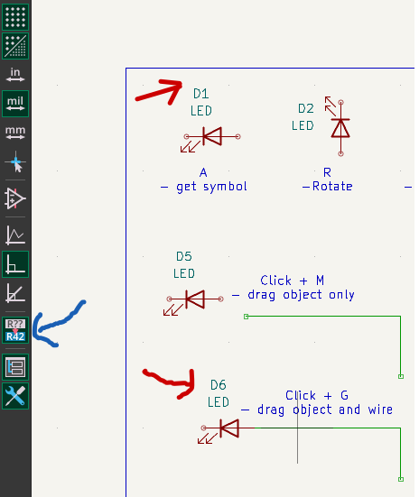
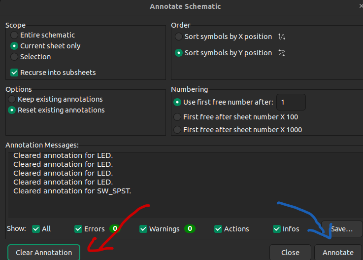

# Referrences
- [Previous Topic 001](./_001_GettingStarted_KiCad.md)
- [Project 001](../Design/_001_Get_start/Get_Start/)

- Annotate a component
    - [Method 1 annotate when drawing schematic](#method-1-annotate-when-design)
    - [Method 2 annotate after designed](#method-2-annotate-after-design)

## Annotate a component
### Method 1: Annotate when design
- Click symbol `R??>R42` on the left toolbar for turn `on/off` auto annotate

    

### Method 2: Annotate after design
- Go to `Tools -> Annotate Schematic...`

    

