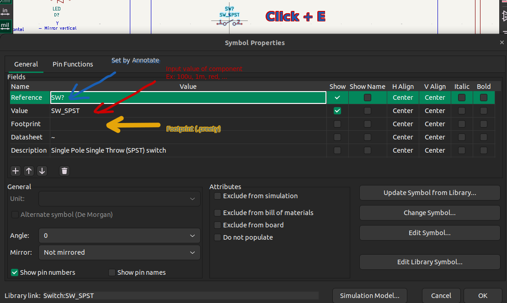
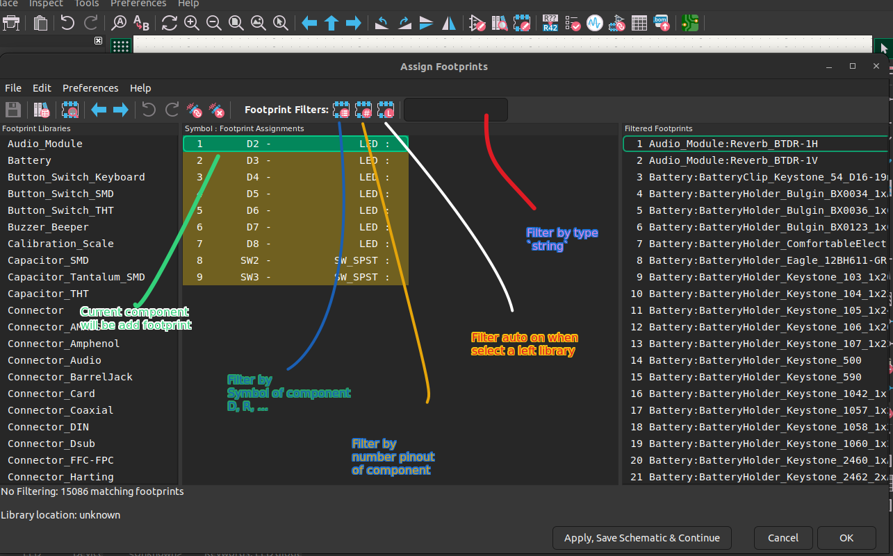

# Referrences
- [Topic 001](./_001_GettingStarted_KiCad.md)
- [Project 001](../Design/_001_Get_start/Get_Start/)
- IEEE Std 315-1975 (Graphic Symbols for Electrical and
Electronics Diagrams)

- Symbol properties
    - [Properties](#properties)
    - [Add footprint](#add-footprint)

## Symbol properties

### Properties
- Hotkey `Click + E` on component to show this symbol properties
- Modify field `Value` then schematic display

### Add footprint
- Footprint determine how component layout on PCB, it include 3D view, through hole, sink screen,...
- Add footprint:
    - Method 1: 1 component - choose 1 footprint available in field `Footprint` above.
    - Method 2: Using Assign Footprint below to apply footprintf for all component  
- 

