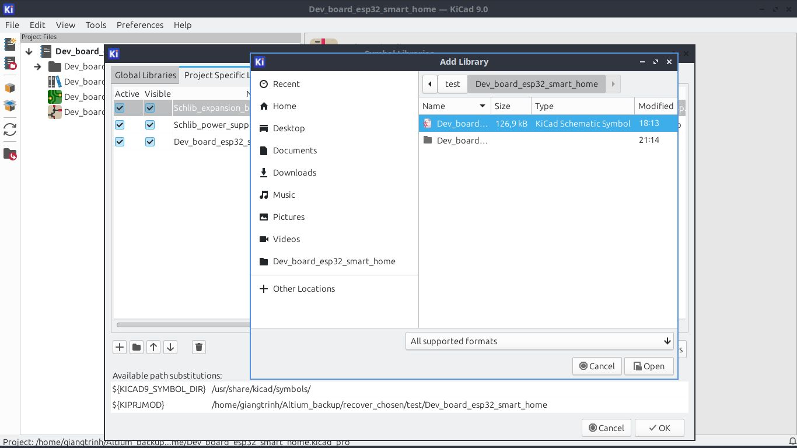

## Topic 

### Import design and global symbol libraries
- From KiCad project manager, select `Preferences → Manage Symbol Libraries`:
    - Choose global libraries want import from tab `Global libraries`
    - Choose designed libraries in tab `Project Specific Libraries`
        - click add by icon folder then select option file types support:
            

### Create new symbol libraries
- From KiCad project manager, select function `Symbol Editor`

####  In `Symbol Editor` add newlibraries
- First `File -> New library` then choose option `Global` or `Project` scope
- Then typing name for new library `.kicad_sym`
- Now in the list of library filter and find `just created library` name, then `right click` -> `New symbol`, include several field:
    - Pin name: abbreviation of function
    - Pin number: order number for pin, using design from datasheet and matching with footprint order in the future.
    - Electrical type:
        - input, output, bidirection, tristate,   
        - passive, free, unspecified, powerinput, power output, 
        - open colector, open emitter, unconnected
    - Tips: After create a pin, push on `Insert` button on keyboard then a new pin will create and auto numbering
- More configure properties: `File -> Symbol Properties` or just click label on top toolsbar
    - Here we can modify, hide/show some field like:
        - Reference: Symbol for descripte type of component
        - Value: ...C, ...H, ...uF,...
        - Footprint: Add designed footprint
        - Datasheet: Add datasheet
        - Description: Detailed description